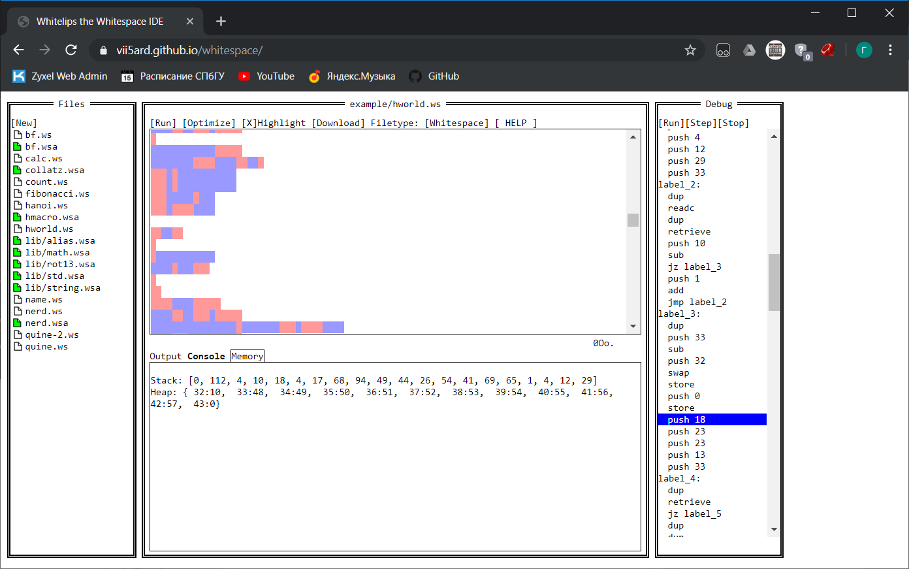
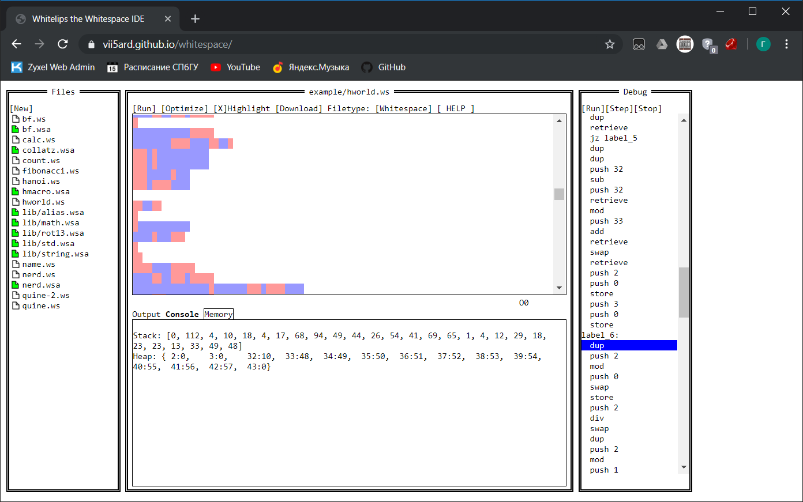
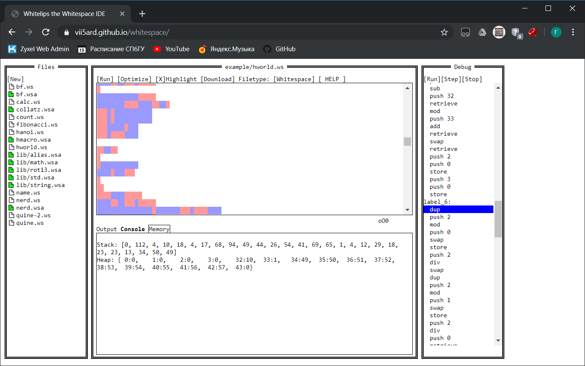
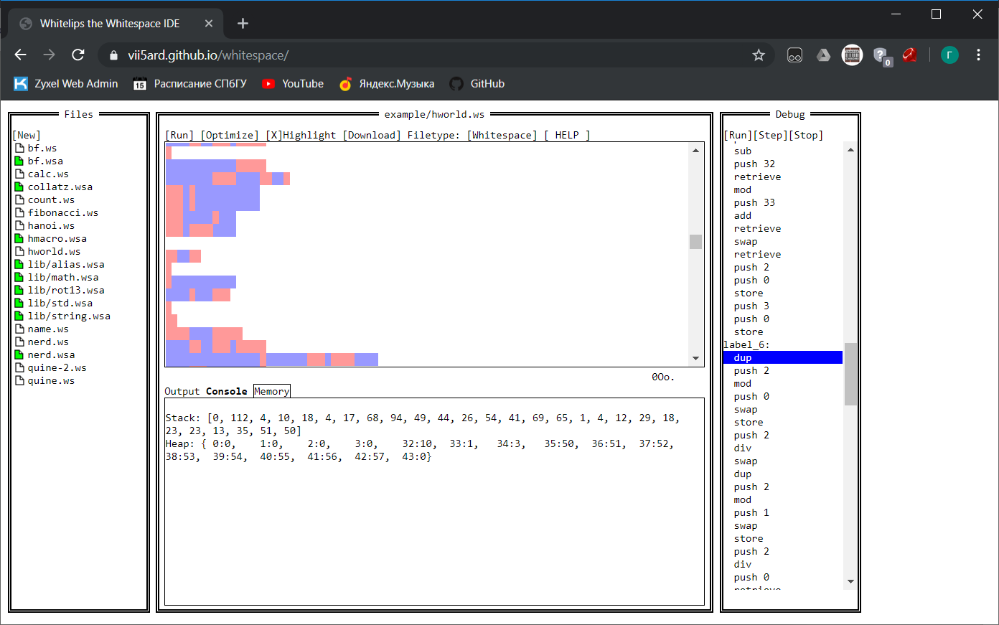

# Bad formatting 2 - Reverse, 250 баллов [Дорешивание]

При запуске программы из первой части таска можно было заметить, что она, помимо вывода флага, еще и просит ввести другой. Давайте попробуем понять, какой же флажок придется ей по вкусу.

На том же [сайте](https://vii5ard.github.io/whitespace/), что и в первой части, справа можно было заметить своеобразный отладчик. Давайте немного потрассируем код из таска и попытаемся понять, что же он делает. 

Начнем с простого. `label_1` работает в цикле, да еще и содержит команду `printc`. Функция явно печатает строку, лежащую на стеке. 
```
label_1:
  dup
  jz label_13
  printc
  jmp label_1
label_13:
  drop
  ret
```
Рядом находятся и `label_10`, и `label_11`, которые используют `label_1`. Если мы переведем значения, которые кладутся в них на стек, придем к выводу, что `label_10` печатает `Good`, а `label_11` - `Bad`. 
```
label_10:
  swap
  sub
  jn label_11
  push 0
  push 100
  push 111
  push 111
  push 71
  call label_1
label_11:
  push 0
  push 100
  push 97
  push 66
  call label_1
  jmp label_12
label_12:
  end
```
Точка входа `label_0` несколько раз вызывает `label_1`, однако после этого она кладет на стек какие-то числа, явно не являющиеся ASCII-кодами:
```
push 26
push 54
push 41
push 69
push 65
push 1
push 4
push 12
push 29
push 33
```
Ясно, что скорее всего они как-то используются для проверки введенного флага. Попытаемся понять, как. В `label_2` считывается введенная пользователем строка (что можно понять по инструкции `readc`). 

Что делает `label_3`? Поставим бряку где-нибудь в конце и посмотрим на память интерпретатора (в качестве строки я ввел `0123456789`)



Как видим, в куче: `heap[32] = 10` (длина введенной строки), а, начиная с `heap[33]`, на куче лежит введенная строка, ограниченная справа нулем. 

Как видим, `label_4` положила на стек второй и первый символы строки:



Посмотрим на `label_6`:
```
label_6:
  dup
  push 2
  mod
  push 0
  swap
  store
  push 2
  div
  swap
  dup
  push 2
  mod
  push 1
  swap
  store
  push 2
  div
  push 0
  retrieve
  push 1
  retrieve
  add
  push 2
  mod
  push 2
  retrieve
```

`label_6` в псевдокоде можно описать так (`c0` - последний элемент стека, `c1` - предпоследний):
```cpp
heap[0] = c0 % 2; c0 /= 2;
heap[1] = c1 % 2; c1 /= 2;

push((heap[0] + heap[1]) % 2)
push(heap[2])
```
На что это похоже? На побитовый `xor`! (`heap[0]` - младший бит `c0`, `heap[1]` - `c1`, после получения битов совершается сдвиг вправо этих чисел). Какие числа `xor`-ятся? Давайте посмотрим (смотрим на последние два элемента стека). 






Как видим, последовательно `xor`-ятся первый и второй символы введенной строки, второй и третий, и так далее. Мы знаем, что флаг начинается c `ytctf`. Попробуем провести описанную процедуру с символами этой строки:
```python
>>> ord('y') ^ ord('t')
13
>>> ord('t') ^ ord('c')
23
>>> ord('c') ^ ord('t')
23
>>> ord('t') ^ ord('f')
18
>>>
```
А теперь посмотрим внимательнее на стек. Да эти числа же лежат на стеке! Что ж, подытоживая все это, давайте восстановим флаг:
```python
>>> l = [0, 112, 4, 10, 18, 4, 17, 68, 94, 49, 44, 26, 54, 41, 69, 65, 1, 4, 12, 29, 18, 23, 23, 13]
>>> l.reverse()
>>>
>>> char = 'y'
>>> flag = ''
>>>
>>> for x in l:
...     flag += char
...     char = chr(ord(char) ^ x)
...
>>> print(flag)
ytctf{wsr3v_is_n0teasy}
>>>
```
А вот и флажок, который можно сдать на борде!

**Флаг:** `ytctf{wsr3v_is_n0teasy}`
