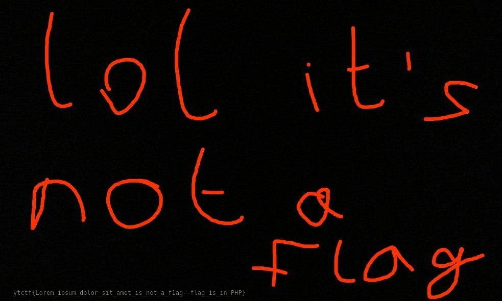

# FOTOSTORAGE™ - Web, 100 баллов

Заходим на замечательный сайт, который нам предлагает загрузить картинку на сервер.

Но мы не хотим загружать картинку, мы - хакеры. Пробуем загрузить шелл `sh.php`.

Иии... Успех! Получаем что-то типа [такого](https://fotostorage.ctf.yummytacos.me/QDmSumT3eY/XhE2sE99TD.php). Поднимемся чуть выше по директориям и видим кучу папок с рандомно сгенерированными названиями, внутри которых лежат загруженные файлы. Хакеры - люди занятые, поэтому получим список всех файлов более быстрым способом, чем ручками:

```
$ ls ./*/*

./-30mpevILz/W44uCvg39A.jpg
./-jk7uJQrvg/nIPp3es-Sy.jpg
./-k96bDMP9y/2WIFnQVcNQ.jpg
./-ohGM2m3mp/bpvx7BKvi_.jpg
./-pcbigrpOQ/z0QjLS6S1Q.jpg
./0-Kp1nTMMg/VHW1VQ8Bed.jpg
          ...
./EwjHG2SHX1/F1@g.jpg
          ...
./yY63NZYmIs/RNG93woLua.jpg
./yk607rNDlw/MRP4zz34Fp.jpg
./zAk_9pdMZU/mti28x7gik.jpg
./zF0uaVhagu/G7WmZN_EeS.jpg
./zL2epfLDIh/Stxo4YVQrK.jpg
./zT_RyJUkEN/UV_P5lxfJO.jpg
```

Вывод получился довольно длинным, поэтому многие строки были опущены. Очень внимательный читатель заметит файл `./EwjHG2SHX1/F1@g.jpg`:



Не стоить верить агрессивному красному тексту, в этой картинке на самом деле есть флаг, он находится в самом низу.

Не стоить верить флагу, который говорит, что он не флаг.

Радуемся находке и вводим его!

Так, как это `400: Wrong flag`? В смысле неправильный флаг? Блин, борда, прими флаг... Ну пожалуйста...

А, НУ ДА, КОНЕЧНО!!! Обожаю писать слово флаг разными способами, вот же они, слева направо: `flag`, `f1ag`... (*Пояснение: на этом моменте команда улетела в открытый космос на собственной реактивной тяге*)

**Флаг:** `ytctf{Lorem_ipsum_dolor_sit_amet_is_not_a_f1ag--flag_is_in_PHP}`
