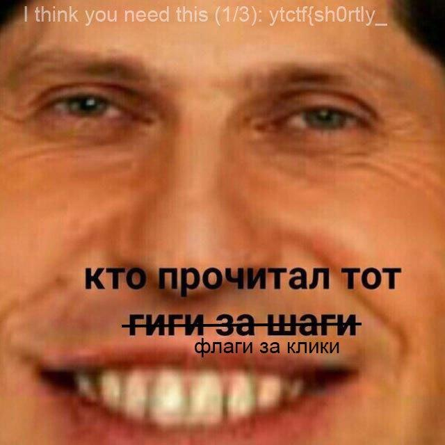

# SAYT - Recon, 100 баллов

Возможно, таск получился слегка локальным, поэтому его решили не так много команд.
Нам было известно, что у одного из организаторов (`@evgfilim1`) есть блог в запрещенном на территории РФ мессенджере. Он носит название `Shotly about Evgen` (`@evgfilim1_blog`).

Листая посты, замечаем, что у поста от 11 сентября есть 1 комментарий. Почему бы не прочесть, что там написано?

А написано там следующее:

```
I think you need this (3/3): YummyTacos}
```

Отлично, мы копаем в правильном направлении. Поищем ещё блоги с подобным названием... О, да `@GeekaN` тоже, оказывается, имеет блог: `Shortly about GeekaN` (`@SAGeekaN`).

Спасибо ему, что он никак не шифровался. Второй кусок сообщения просто был выложен отдельным постом 30 сентября:

```
I think you need this (2/3): about_
```

Судя по всему, остался всего один кусок сообщения. Но погодите, больше таких блогов нет, что делать? Ещё раз полистаем блог. Видим, что GeekaN переслал пост из блога `@alyukovnetstudio`, ещё одного организатора (`@alyukovnet`). Зайдём и туда.

Смотрим, листаем, читаем, случайно замечаем, что в блоге 30 сентября поменялась ава.

Кому флаги за клики?



```
I think you need this (1/3): ytctf{sh0rtly_
```

Складываем кусочки паззла... Стоп, да это ж флаг!

**Флаг:** `ytctf{sh0rtly_about_YummyTacos}`
