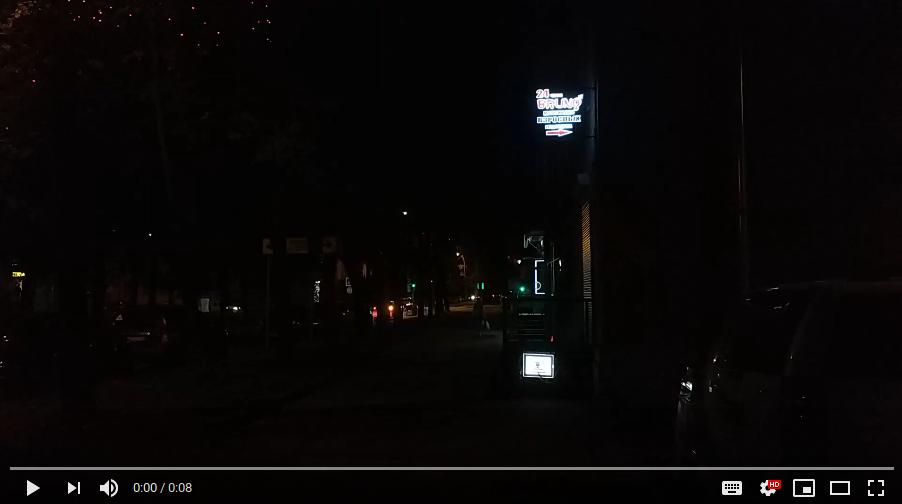

# Street Attack - Recon, 100 баллов

Открываем видео (ШОК-КОНТЕНТ, СЛАБОНЕРВНЫМ НЕ СМОТРЕТЬ). Первым кадром мы отчётливо видим какую-то вывеску:



Это какой-то магазин для взрослых. Ищем по названию и выясняем, что данный магазин находится по адресу Алтайская, 23 в Санкт-Петербурге.
С помощью какого-нибудь приложения-карты смотрим координаты и округляем до 4 знака после запятой (этого требует чекер):

```
59.8492, 30.3292
```

Вводим в чекер эти координаты и токен авторизации (требовался для определения команды, чтобы исключить брутфорс координат), за что получаем заветную последовательность символов.


**Флаг:** `ytctf{Saint-Petersburg_aka_g0r0d-n4-n3v3}`
