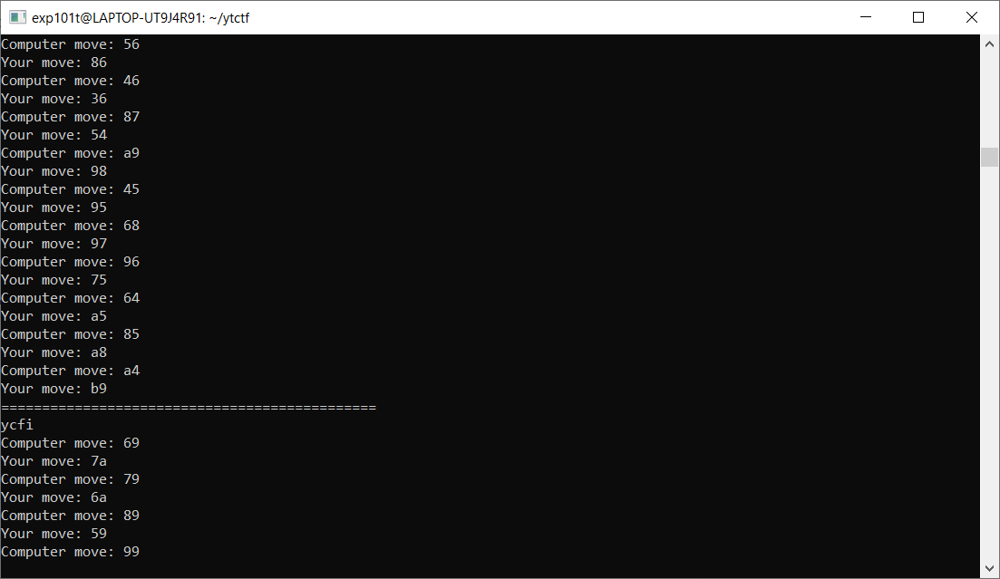
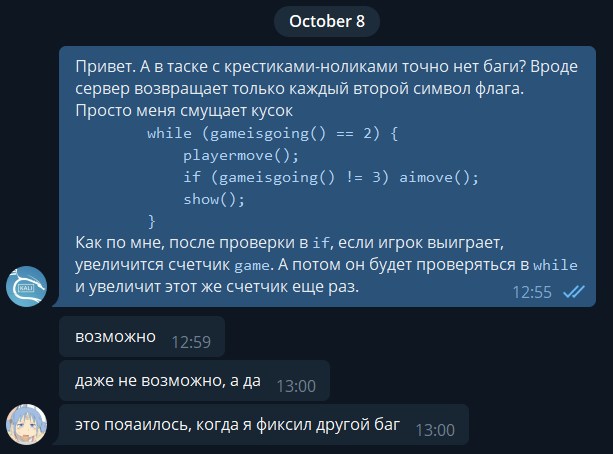

# Tic-Tac-Toe - PPC, 200 баллов [Нерешетабелен]
Пытаемся немного поиграть с ботом и понимаем, что, несмотря на [заверения автора](https://t.me/ytctf_chat/3581), бот не поддается.

Тем не менее, другой бот, например, собранный из [этого](https://github.com/yunzhu-li/blupig-gomoku) репозитория, вполне неплохо с ним сражается.

Что ж, собираем этого бота и набрасываем простенький [скрипт](solver.py), который будет играть с ботом из таска с помощью только что скомпилированного. Замечаем, что сервер возвращает только каждый второй символ флага.



В чем же дело? Заглянем в [исходные коды](TicTacToe_withoutflag.cpp), которые выложили после официального окончания соревнования и увидим следующее:
```cpp
while (gameisgoing() == 2) {
    playermove();
    if (gameisgoing() != 3) aimove();
    show();
}
```
В чем проблема? Дело в том, что `gameisgoing` увеличивает глобальную переменную `game` на единицу при условии, что игрок выиграл. Только вот внутри `while` эта функция вызывается еще раз, и увеличивает тот же счетчик еще раз. Как результат - таск нерешаем. Что ж, давайте напишем автору об этом и получаем примерно следующий ответ:



Что ж, надеемся, что проблему пофиксят в ближайшее время. Надежда умирает последней, а проблему не фиксят даже на момент написания этих райтапов (вечер 12 октября). 

**Флаг:** `ytctf{i_l0v3_71c-74c-703_v3ry_much_c0z_it5_my_f4v0rit3_game_1_ev3r_played_l0l_th3b3s7}`
